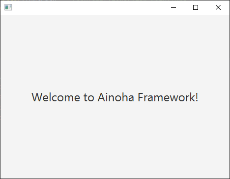

[](https://repo1.maven.org/maven2/com/github/ainoha-framework/ainoha-core)
[](https://javadoc.io/doc/com.github.ainoha-framework/ainoha-core)
[](https://opensource.org/licenses/Apache-2.0)

# Ainoha Framework
Is a lightweight framework for developing JavaFX 11 (and later) applications in a fast way.

We strongly believe that use the `FXML` language for build the application user interface (UI)
is the better development approach when we use JavaFX. Because of this, Ainoha Framework was
designed around this feature, and our goal is to improve the way we are using it.

If you are not familiar with `FXML` you can take a look at the
[official documentation](https://openjfx.io/javadoc/11/javafx.fxml/javafx/fxml/doc-files/introduction_to_fxml.html).

## Usage
Next sections show how to start using this framework to develop a non-modular application
(*the full code can be found here:
[non-modular-hello-world](https://github.com/ainoha-framework/examples/tree/master/hello-world/non-modular-hello-world)*).

---

***WARNING!***
*Developing modular applications requires make some configurations in the `module-info.java`
file. In the documentation we will address this issue (soon). An application example of this
can be found here:
[modular-hello-world](https://github.com/ainoha-framework/examples/tree/master/hello-world/modular-hello-world)).*

---

### Add Maven dependency
```xml
<dependency>
    <groupId>com.github.ainoha-framework</groupId>
    <artifactId>ainoha-core</artifactId>
    <version>1.0.RC5</version>
</dependency>
```

### Create a FXML file
We'll create this file in the package `com.app.views` with the name `view-main.fxml` (*You can
use [JavaFX Scene Builder](https://gluonhq.com/products/scene-builder/) for do it*).
```xml
<?xml version="1.0" encoding="UTF-8"?>

<?import javafx.scene.control.Label?>
<?import javafx.scene.layout.AnchorPane?>
<?import javafx.scene.text.Font?>

<AnchorPane prefHeight="332.0" prefWidth="466.0"
        xmlns="http://javafx.com/javafx/11.0.1"
        xmlns:fx="http://javafx.com/fxml/1">

   <children>
      <Label layoutX="67.0" layoutY="131.0" textAlignment="CENTER"
            text="Welcome to Ainoha Framework!">
         <font>
            <Font size="24.0" />
         </font>
      </Label>
   </children>
</AnchorPane>
```
Note that we don't bind this view to any controller class.

### Create the view controller
```java
package com.app.controllers;

import com.ainoha.core.annotation.FxmlController;

@FxmlController(fxmlPath = "/com/app/views/view-main.fxml")
public class MainViewController {

}
```
With the annotation `@FxmlController` we define a view controller for a specific `FXML` file.

### Create an Application class
The Application class is the most important class in a JavaFX application, so we need to annotate
this class with `@FxApplication` in order to be able to start the application using Ainoha
Framework.
```java
package com.app;

import com.ainoha.core.ApplicationContext;
import com.ainoha.core.ViewLoader;
import com.ainoha.core.annotation.FxApplication;
import com.app.controllers.MainViewController;
import javafx.application.Application;
import javafx.stage.Stage;

@FxApplication
public class MyApplication extends Application implements ViewLoader {

    public static void main(String[] args) {
        ApplicationContext.startApplication(MyApplication.class, args);
    }

    @Override
    public void start(Stage stage) {
        view(MainViewController.class)
                .stage(stage)
                .show();
    }
}
```
The traditional way to start a JavaFX application is by calling the method `launch()` from
the `main()`. With Ainoha Framework the right way is to use
`ApplicationContext.startApplication(MyApplication.class, args)`.

`ViewLoader` interface give us the default method `view()` that allows to show a view through
its controller, and tweak it to our needs.

### Create the launcher (for non-modular applications ONLY)
```java
package com.app;

public final class Launcher {
    public static void main(String[] args) {
        MyApplication.main(args);
    }
}
```

### Run the application
After compile the project with Maven (we assume you configured the POM to create an executable
JAR and to copy the dependencies into the `target/libs` directory. How to do it
[here](https://www.baeldung.com/executable-jar-with-maven)) we are able to run the following
command at the project root directory.
```
$ java -jar target/my-fx-app-<version>.jar
```

and see a window like this...



# License
Ainoha Framework is Open Source software released under the [Apache-2.0 License](LICENSE)
